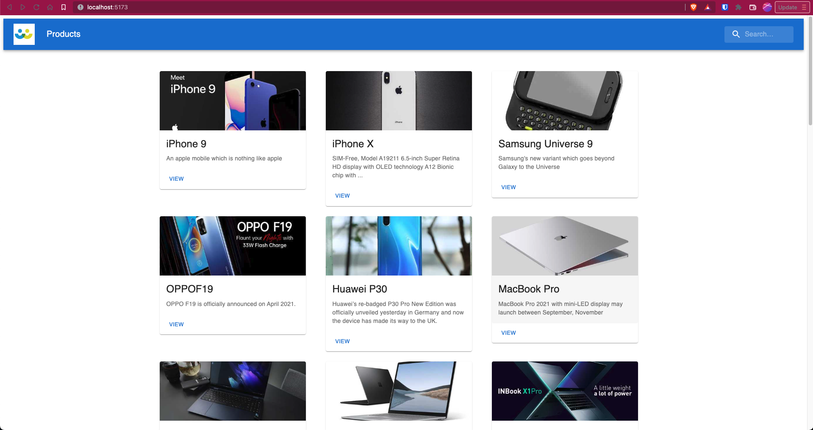
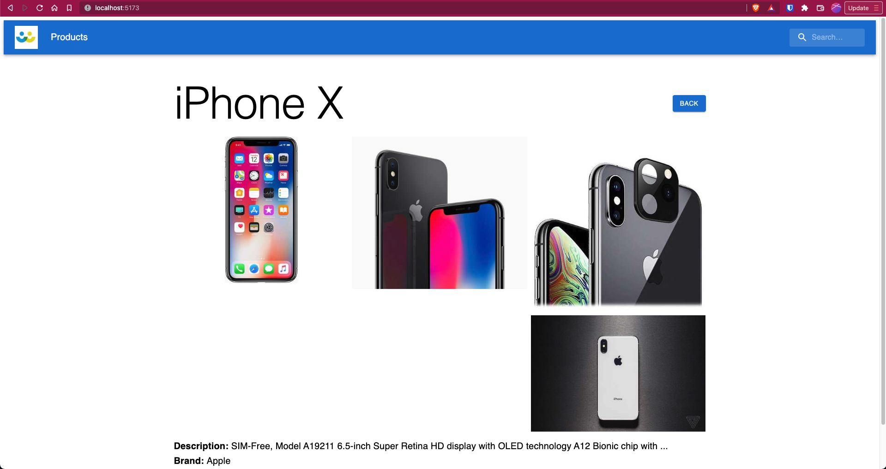
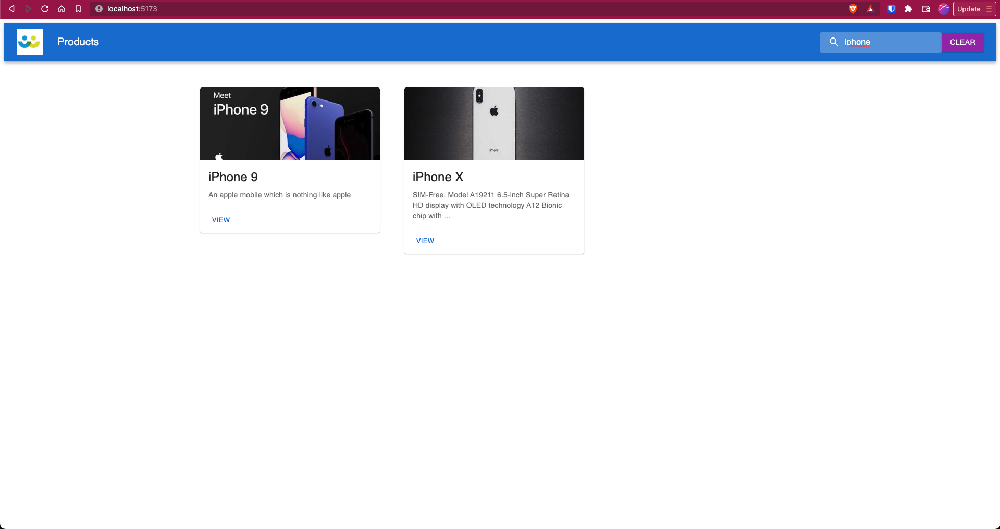

# Products UI API Assignment

# Features

* Product Search Page
* Debounce Search
* Product View Page
* Ability to clear the search

## Technologies

* React
* MaterialUI v5
* Typescript
* Redux

## Previews

## Scripts

- `dev`/`start` - start dev server and open browser
- `build` - build for production
- `preview` - locally preview production build
- `test` - launch test runner

## License

See [LICENSE](LICENSE) © [randikabanura](https://github.com/randikabanura/)